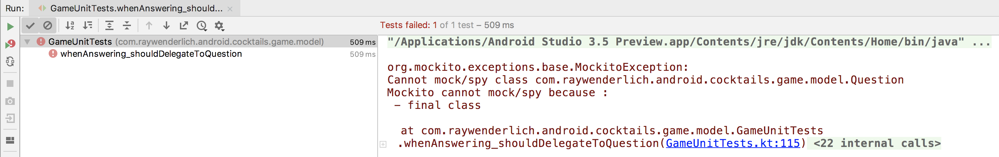
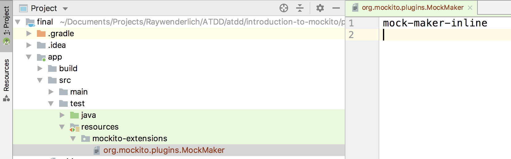
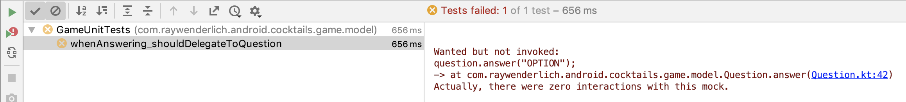
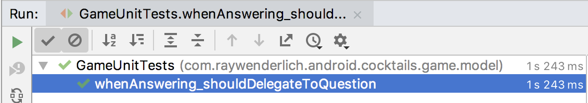
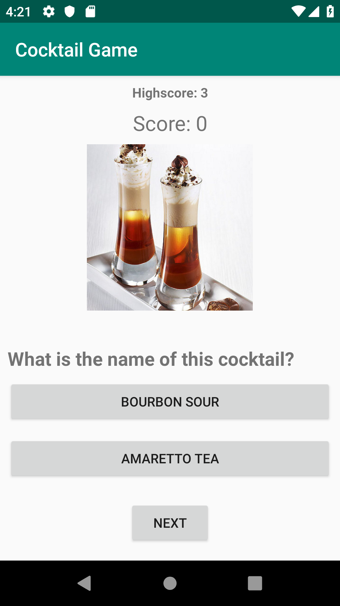

# Глава 7: Введение в Mockito
By Fernando Sproviero

Вы  часто  будете  сталкиваться  с  ситуациями,  когда  хотите  написать  тест  для метода  класса,  который  требует  сотрудничества  с  другим  классом.  Модульные тесты обычно фокусируются на одном классе, поэтому вам нужен способ избежать использования  их  реальных  соавторов.  В  противном  случае  вам  пришлось  бы проводить  интеграционное  тестирование,  которое  вы  увидите  в  главе  8 «Интеграция». 

В этой главе вы: 

- Узнайте, что такое имитации и заглушки и когда использовать эти приемы. 

-  Напишите  больше  модульных  тестов,  используя  шаблон  разработки  через тестирование (TDD), чтобы продолжить тестирование состояния, а также способ проверки поведения.


## Почему Мокито? 

Если вы помните из предыдущей главы, всякий раз, когда вы создаете тест, вы должны: 

- Во-первых, настройте то, что вы собираетесь тестировать. 

- Во-вторых, запустите метод, который вы хотите протестировать. 

- Наконец, проверьте результат, проверив состояние тестируемого объекта. Это называется  проверкой  состояния  или  тестированием  методом  черного  ящика. Это то, что вы сделали с помощью `JUnit`.

Однако для выполнения проверки состояния иногда тестируемый объект должен взаимодействовать  с  другим.  Поскольку  вы  хотите  сосредоточиться  на  первом объекте,  на  этапе  настройки  вы  хотите  предоставить  тестируемому  двойному соавтору  тестируемый  объект.  Этот  поддельный  соавтор  предназначен  только для  целей  тестирования,  и  вы  настраиваете  его,  чтобы  он  вел  себя  так,  как  вы хотите. Например, вы можете сделать макет, чтобы вызов метода на нем всегда возвращал  одну  и  ту  же  жестко  запрограммированную  строку.  Это  называется заглушкой метода. Для этого вы будете использовать Mockito. 

Существует  еще  один  тип  проверки,  называемый  проверкой  поведения  или тестированием белого ящика. Здесь вы хотите убедиться, что ваш тестируемый объект будет вызывать определенные методы совместной работы. Например, у вас может быть объект репозитория, который извлекает данные из сети и перед возвратом  результатов  вызывает  объект-сотрудник,  чтобы  сохранить  их  в  базе данных. Опять же, вы можете использовать Mockito, чтобы следить за соавтором и проверять, вызывались ли для него определенные методы.

> [!NOTE] **Примечание** 
> Использование тестирования «белого ящика» позволяет вам быть более точными в тестах, но часто приводит к необходимости вносить дополнительные изменения в тесты при изменении производственного кода. 

## Настройка Мохито 

Откройте файл` build.gradle` приложения и добавьте следующую зависимость:

```kotlin 
dependencies { 
	... 
	testImplementation 'org.mockito.kotlin:mockito-kotlin:3.2.0' 
} 
```

Mockito-Kotlin  —  это  библиотека-оболочка  вокруг  `Mockito`.  Он  предоставляет функции верхнего уровня, позволяющие использовать подход, более похожий на  Kotlin,  а  также  решает  несколько  проблем  с  использованием  библиотеки `Mockito` Java в Kotlin.


## Создание юнит-тестов с помощью Mockito

Позже в пользовательском интерфейсе вы покажете пользователю вопрос с двумя вариантами ответа. Вы хотите, чтобы пользователь щелкнул по одному из них. Затем ваш класс Game обработает этот ответ, делегировав его классу `Question`. Оценка  будет  увеличена,  если  ответ  был  правильным,  и  будет  возвращен следующий вопрос.


## Имитация (mocking) и проверка 

Начните с добавления следующего теста в файл `GameUnitTests.kt`:

```kotlin 
@Test 
fun whenAnswering_shouldDelegateToQuestion() { 
	// 1 
	val question = mock<Question>() 
	val game = Game(listOf(question)) 
	
	// 2 
	game.answer(question, "OPTION") 
	
	// 3 
	verify(question, times(1)).answer(eq("OPTION")) 
} 
```

>[!NOTE] **Примечание**  
>При  импорте  функций  `mock`,  `verify`,  `times`  и  `eq`  следует выбрать вариант, начинающийся с `org.mockito.kotlin.`, чтобы использовать функции из библиотеки `Mockito-Kotlin` вместо `org.mockito.Mockito.`, которая имеет свои собственные версии этих функций, но они дадут разные результаты, поскольку они не были разработаны для `Kotlin`.

В этом тесте: 

1.  Методу  игры  `answer()`  нужен  вопрос,  чтобы  узнать  ответ.  Игра  делает  это, передавая вопрос своему методу `answer()`. Таким образом, вы создаете макет `Question`, который вы можете позже проверить.
2. Вызовите метод `answer()` игры, передав макет `Question` в качестве параметра.
3. Убедитесь, что метод `answer()` был вызван в макете `Question`. Вы использовали режим  проверки  `times(1)`  для  проверки  того,  что  метод  `answer()`  был  вызван ровно  один  раз.  Вы  также  использовали  сопоставитель  аргументов  `eq`  для проверки того, что метод `answer()` был вызван со строкой, равной `OPTION`.

Вы можете опустить `times(1)`, так как это значение по умолчанию. Поэтому измените код на следующий:

```kotlin 
verify(question).answer(eq("OPTION")) 
```

>[!NOTE] **Примечание**
>Существуют также другие режимы проверки, такие как `never()`, `atLeast()`,  `atMost()`  и  другие  средства  сопоставления  аргументов,  такие  как `eq()`, `same()`, `any()`, которые вы можете использовать в зависимости от вашего теста.

Попробуйте  скомпилировать  и  запустить  тест.  Вы  увидите  ошибку,  потому что в классе Game еще нет метода `answer()`. 

Откройте класс Game и создайте метод `answer()`:

```kotlin 
fun answer(question: Question, option: String) { 
	// TODO 
} 
```

Запустите тест. Вы увидите, что это не проходит:



Это  связано  с  тем,  что  классы  и  методы  Kotlin  по  умолчанию  являются окончательными.  `Mockito`  не  будет  работать  с  окончательными  классами/методами из коробки. Чтобы исправить это, у вас есть следующие варианты: 

-  Используйте  встроенное  расширение  `mock-maker-inline,`  чтобы  позволить  Mockito имитировать окончательные классы/методы. 

- Добавляйте ключевое слово `open` к классам и методам, над которыми вы будете работать. 

-  Создайте  интерфейс  и  реализуйте  его  в  классе.  Затем  просто  смоделируйте интерфейс (по умолчанию интерфейсы открыты).


## Расширение mock-maker-inline 

- Перейдите к окну проекта и переключитесь на представление проекта.

- Создайте каталог ресурсов в `app > src > test`. 

-  Внутри  ресурсов  создайте  каталог  с  именем  `mockitoextensions`  

-  Добавьте текстовый файл с именем `org.mockito.plugins.MockMaker` 

- Добавьте текст `mockmaker-inline` 

См. изображение ниже:



Теперь вы можете вернуться и запустить последний созданный вами тест и увидеть, что он все еще не проходит, но на этот раз с другой ошибкой:



Здесь он заявляет, что ожидал вызова метода `answer()` класса `Question`. 
Итак, теперь исправьте метод `answer()` с правильной реализацией:

```kotlin
fun answer(question: Question, option: String) { 
	question.answer(option) 
}
```

Теперь запустите тест и убедитесь, что он проходит:




## Методы заглушки 

Игра должна увеличивать текущий счет при правильном ответе, поэтому  добавьте следующий тест:

```kotlin
@Test 
fun `when Answering Correctly should Increment Current Score`() { 
	// 1 
	val question = mock<Question>() 
	whenever(question.answer(anyString()))
		.thenReturn(true) 

	val game = Game(listOf(question)) 
	
	// 2 
	game.answer(question, "OPTION") 
	
	// 3 
	Assert.assertEquals(1, game.currentScore) 
}
```

В приведенном выше вы: 

1. Снова имитируем классвопросов. Используя `when/method/thenReturn`, вы заглушаете метод` question.answer()`, чтобы он всегда возвращал `true`. Обратите внимание, что здесь вы использовали сопоставитель аргументов `anyString()`, так как вам все равно, какая конкретная строка вам нужна для заглушки вызова.

>[!NOTE] **Примечание**  
>Здесь  вы  можете  использовать  специальный сопоставитель строк, что сделает тест более надежным.

2. Вызвать метод `answer()` игры. 

3. Убедитесь, что счет игры увеличился.

Запустите тест, и вы увидите, что он не работает. Добавьте следующий код в метод `answer()` класса `Game`:

```kotlin 
fun answer(question: Question, option: String) { 
	question.answer(option) 
	incrementScore() 
} 
```

Теперь запустите тест еще раз, и вы увидите, что он проходит.

Вы также захотите проверить, не увеличивается ли счет при неправильном ответе. Для этого добавьте следующий тест:

```kotlin 
@Test 
fun `when Answering Incorrectly should Not Increment Current Score`() { 
	val question = mock<Question>() 
	whenever(question.answer(anyString())).thenReturn(false) 
	
	val game = Game(listOf(question)) 
	
	game.answer(question, "OPTION") 
	
	Assert.assertEquals(0, game.currentScore) 
} 
```

Здесь  вместо  этого  вы  заглушаете  метод  `answer()`,  чтобы  он  всегда  возвращал  `false`. 

Запустите тест, и вы увидите, что он не работает. Хорошо, что вы проверили это граничное условие! Чтобы исправить это, замените метод `answer()` следующим:

```kotlin 
fun answer(question: Question, option: String) { 
	val result = question.answer(option) 
	
	if (result) { 
		incrementScore() 
	} 
} 
```

Это добавляет проверку, чтобы увеличить счет только в том случае, если ответ правильный. Теперь запустите оба теста, и вы увидите, что они пройдены. 


## Рефакторинг 

Откройте класс `Game`. Обратите внимание, что этот класс знает о счете и списке вопросов.  При  запросе  ответа  на  вопрос  класс  `Game`  делегирует  это  классу `Question`  и  увеличивает  счет,  если  ответ  был  правильным.  Игра  также  может быть реорганизована, чтобы делегировать логику увеличения текущего счета и наивысшего результата новому классу `Score`.

Создайте класс `Score` в том же пакете, что и класс `Game`, со следующим содержимым:

```kotlin 
class Score(highestScore: Int = 0) { 
	var current = 0 
		private set 
	
	var highest = highestScore 
		private set 
	
	fun increment() { 
		current++ 
		if (current > highest) { 
			highest = current 
		} 
	} 
} 
```

Теперь обновите класс `Game`, чтобы использовать этот новый класс:

```kotlin 
class Game(
	private val questions: List<Question>, 
	highest: Int = 0
) { 
	private val score = Score(highest) 
	
	val currentScore: Int 
		get() = score.current 
		
	val highestScore: Int 
		get() = score.highest 
		
	private var questionIndex = -1 
	
	fun incrementScore() { 
		score.increment() 
	} 
	...
	```

Запустите тесты еще раз и убедитесь, что все еще работает. 

С этим изменением взгляните еще раз на следующие модульные тесты из `GameUnitTests.kt`:

```kotlin 
@Test 
fun `when Incrementing Score should Increment CurrentScore`() { 
	val game = Game(emptyList(), 0) 	
	game.incrementScore() 	
	Assert.assertEquals("Current score should have been 1", 1, game.currentScore) 
} 

@Test 
fun `when Incrementing Score above High Score should Also Increment High Score`() { 
	val game = Game(emptyList(), 0) 
	game.incrementScore() 
	Assert.assertEquals(1, game.highestScore) 
} 

@Test 
fun `when Incrementing Score below High Score should Not Increment High Score` () { 
	val game = Game(emptyList(), 10) 
	game.incrementScore() 
	Assert.assertEquals(10, game.highestScore) 
}
```

При вызове `game.incrementScore()`, `game.highestScore` или game.`currentScore` из-за  рефакторинга  для  внутреннего  делегирования  зависимому  классу  `Score`  вы теперь выполняете интеграционные тесты. Вы увидите и узнаете о них больше в главе 8 «Интеграция». 

Чтобы сохранить ваши тесты на уровне модулей, удалите эти тесты из `GameUnitTests.kt` и создайте новый файл с именем `ScoreUnitTests.kt` со следующим содержимым:

```kotlin 
class ScoreUnitTests { 

	@Test fun `when Incrementing Score should Increment Current Score`() { 
		val score = Score() 
		score.increment() 
		Assert.assertEquals( "Current score should have been 1", 1, score.current) 
	}  

	@Test 
	fun `when Incrementing Score above High Score should Also Increment High Score`() { 
		val score = Score() 
		score.increment() 
		Assert.assertEquals(1, score.highest) 
	} 

	@Test 
	fun `when Incrementing Score below High Score should Not Increment High Score` () { 
		val score = Score(10) 
		score.increment() 
		Assert.assertEquals(10, score.highest) 
	} 
}
```

Это возвращает ваши тесты на уровень модулей, поскольку вы тестируете методы объекта Score без зависимых классов. 

Запустите их, чтобы убедиться, что они проходят. 

С  этим  рефакторингом  единственным  методом,  который  все  еще  использует метод `incrementScore()` в вашем классе Game, является метод `answer()`. Давайте упростим  это.  Удалите  метод  `incrementScore()`  и  измените  метод  `answer()` следующим образом:

```kotlin
fun answer(question: Question, option: String) { 
	val result = question.answer(option) 
	if (result) { 
		score.increment() 
	} 
}
```

Теперь, поскольку вы удалили общедоступный метод `scoreIncrement()`, единственный способ увеличить счет в вашем классе `Game` — это отвечать на вопросы. 

Затем откройте `GameUnitTests.kt` и посмотрите на следующие тесты:

```kotlin
@Test 
fun `when answering correctly should increment current score`() { 
	val question = mock<Question>() 
	whenever(question.answer(anyString())).thenReturn(true) 
	
	val game = Game(listOf(question)) 

	game.answer(question, "OPTION") 
	Assert.assertEquals(1, game.currentScore) 
} 

@Test 
fun `when answering incorrectly should not increment current score`() { 
	val question = mock<Question>() 
	whenever(question.answer(anyString())).thenReturn(false) 
	
	val game = Game(listOf(question)) 
	
	game.answer(question, "OPTION") 	
	Assert.assertEquals(0, game.currentScore) 
}
```

Вы  уже  догадались,  что  теперь  это  интеграционные  тесты.  Это  связано  с  тем, что  вы  вызываете метод  `game.currentScore`,  который  внутренне  зависит  от  класса `Score` из вашего рефакторинга. Чтобы преобразовать их в модульные тесты, вам нужно будет изменить их, чтобы убедиться, что метод `increment()` в классе `Score` был или не был вызван. Для этого замените их на следующие:

```kotlin
@Test 
fun `when answering correctly should increment current score`() { 
	val question = mock<Question>() 
	whenever(question.answer(anyString())).thenReturn(true) 
	
	val score = mock<Score>() 
	
	val game = Game(listOf(question), score) 
	
	game.answer(question, "OPTION") 	
	verify(score).increment() 
} 

@Test 
fun `when answering incorrectly should not increment current score`() { 
	val question = mock<Question>() 
	whenever(question.answer(anyString())).thenReturn(false) 
	
	val score = mock<Score>() 
	
	val game = Game(listOf(question), score) 
	
	game.answer(question, "OPTION") 	
	verify(score, never()).increment() 
}
```

Вы  увидите,  что  сейчас  он  не  компилируется,  потому  что  вы  передаете  список вопросов и счет конструктору класса `Game`, но пока он этого не поддерживает.

Чтобы это исправить, откройте класс `Game` и измените конструктор на следующий:

```kotlin
 class Game(
	 private val questions: List<Question>, 
	 val score: Score = Score(0)
) { 
```

Как только это будет сделано, удалите старые свойства `score`, `currentScore` и `highScore`, так как они больше не нужны. Ваш измененный класс `Game` должен быть следующим:

```kotlin
class Game(
	private val questions: List<Question>, 
	val score: Score = Score(0)
) { 
	private var questionIndex = -1 
	
	fun nextQuestion(): Question? { 
		if (questionIndex + 1 < questions.size) { 
			questionIndex++ 
			return questions[questionIndex] 
		} 
		return null 
	} 
	
	fun answer(question: Question, option: String) { 
		val result = question.answer(option) 
		
		if (result) { 
			score.increment() 
		} 
	} 
}
```

Запустите тесты, и теперь все должно пройти. Поздравляем, вы успешно реорганизовали свои тесты и сохранили их на уровне модулей! 

>[!success] commit #1

## Проверка по порядку 

Чтобы сохранить и получить высокий балл, вам нужно добавить функциональность в репозиторий. В представлении `Project` создайте новый пакет `common>repository` в разделе `app>src>test>java>com>raywenderlich>android>cocktails`. Создайте новый файл с именем `RepositoryUnitTests.kt` и добавьте следующий код:

```kotlin
class RepositoryUnitTests { 

	@Test 
	fun `save score should save to shared preferences`() { 
		val api: CocktailsApi = mock() 
		
		// 1 
		val sharedPreferencesEditor: SharedPreferences.Editor = mock()
 
		val sharedPreferences: SharedPreferences = mock() 
		whenever(sharedPreferences.edit())
			.thenReturn(sharedPreferencesEditor) 
		
		val repository = CocktailsRepositoryImpl(api, sharedPreferences) 
		
		// 2 
		val score = 100 
		repository.saveHighScore(score) 
		
		// 3 
		inOrder(sharedPreferencesEditor) { 
			// 4 
			verify(sharedPreferencesEditor)
				.putInt(any(), eq(score)) 
				
			verify(sharedPreferencesEditor)
				.apply() 
		} 
	} 
}
```

Проходим каждый шаг по очереди: 

1.  Вы  собираетесь  сохранить  счет  в  `CocktailsRepository`  с  помощью `SharedPreferences`,  поэтому  вам  нужно  смоделировать  эту  зависимость  и  дать указание возвращать макет редактора всякий раз, когда запрашивается редактор. 
2. Выполните метод `saveHighScore()`.
3. Используйте `inOrder`, чтобы убедиться, что последующие проверки выполняются в точном порядке. 
4. Убедитесь, что счет сохранен правильно. 

Чтобы этот код скомпилировался, добавьте метод `saveHighScore()` в интерфейс `CocktailsRepository`.

```kotlin
 interface CocktailsRepository { 
	 ... 
	 fun saveHighScore(score: Int) 
}
```

Затем измените конструктор `CocktailsRepositoryImpl`, чтобы он принимал `SharedPreferences` в качестве параметра и переопределял метод `saveHighScore()`:

```kotlin
class CocktailsRepositoryImpl( 
	private val api: CocktailsApi, 
	private val sharedPreferences: SharedPreferences
) : CocktailsRepository { 

	override fun saveHighScore(score: Int) { 
		// TODO 
	}
}
```

Запустите тест и убедитесь, что он не работает. Чтобы это исправить, добавьте в класс `CocktailsRepositoryImpl` следующий код:

```kotlin
private const val HIGH_SCORE_KEY = "HIGH_SCORE_KEY" 

class CocktailsRepositoryImpl( 
	private val api: CocktailsApi, 
	private val sharedPreferences: SharedPreferences
) : CocktailsRepository { 
	... 
	override fun saveHighScore(score: Int) { 
		val editor = sharedPreferences.edit() 
		editor.putInt(HIGH_SCORE_KEY, score) 
		editor.apply() 
	}
```

Это  добавляет  логику  к  вашему  методу  `saveHighScore`,  чтобы  сохранить  его  в `sharedPreferences`. Запустите тест еще раз, он пройдет. 

>[!success] commit #2

Вы  также  захотите  иметь  возможность  читать  счет  из  репозитория.  Для начала добавьте следующий тест:

```kotlin
@Test 
fun `get score should get from shared preferences`() { 
	val api: CocktailsApi = mock() 
	val sharedPreferences: SharedPreferences = mock() 
	val repository = CocktailsRepositoryImpl(api, sharedPreferences) 
	
	repository.getHighScore() 
	verify(sharedPreferences).getInt(any(), any()) 
}
```

Затем добавьте метод `getHighScore()` в `CocktailsRepository` и `CocktailsRepositoryImpl`:

```kotlin
interface CocktailsRepository { 
	... 
	fun getHighScore(): Int 
}
```

```kotlin
class CocktailsRepositoryImpl( 
	private val api: CocktailsApi, 
	private val sharedPreferences: SharedPreferences
) : CocktailsRepository { 
	... 
	override fun getHighScore(): Int = 0
```

Запустите тест, убедитесь, что он не прошел, а затем добавьте следующий код в класс `CocktailsRepositoryImpl`, чтобы убедиться, что он прошел успешно:

```kotlin
 override fun getHighScore() = sharedPreferences.getInt(HIGH_SCORE_KEY, 0)
```

>[!success] commit #3

Если  вы  посмотрите  на  эти  два  теста,  вы  можете  заметить,  что  у  вас  есть некоторый код, который повторяется в обоих из них. 

Давайте  высушим  это,  сделаем рефакторинг  ваших  `RepositoryUnitTests`,  чтобы  он выглядел следующим образом:

```kotlin
class RepositoryUnitTests { 

	private lateinit var repository: CocktailsRepository 
	private lateinit var api: CocktailsApi 
	private lateinit var sharedPreferences: SharedPreferences 
	private lateinit var sharedPreferencesEditor: SharedPreferences.Editor 
	
	@Before fun setup() { 
		api = mock() 
		
		sharedPreferences = mock() 
	
		sharedPreferencesEditor = mock() 
		whenever(sharedPreferences.edit()).thenReturn(sharedPreferencesEditor) 
		
		repository = CocktailsRepositoryImpl(api, sharedPreferences) 
	} 
	
	@Test 
	fun `save Score should Save To Shared Preferences`() {
		val score = 100 
		repository.saveHighScore(score) 
		
		inOrder(sharedPreferencesEditor) { 
			verify(sharedPreferencesEditor).putInt(any(), eq(score)) 
			verify(sharedPreferencesEditor).apply() 
		} 
	} 
	
	@Test 
	fun `get Score should Get From Shared Preferences`() { 
		repository.getHighScore() 
		verify(sharedPreferences).getInt(any(), any()) 
	} 
}
```

Запустите тесты еще раз, чтобы убедиться, что все еще работает. 

>[!success] commit #4


## Шпионаж 

Предположим, вы хотите сохранить счет только в том случае, если он выше ранее сохраненного счета. Для этого вы хотите начать с добавления следующего теста в свой класс `RepositoryUnitTests`:

```kotlin
@Test 
fun `save score should not save to shared preferences if lower`() { 
	val previouslySavedHighScore = 100 
	val newHighScore = 10 
	val spyRepository = spy(repository) 
	
	doReturn(previouslySavedHighScore)
		.whenever(spyRepository)
		.getHighScore() 
		
	spyRepository.saveHighScore(newHighScore) 
	
	verify(sharedPreferencesEditor, never())
		.putInt(any(), eq(newHighScore)) 
}
```

В  этом  тесте  вы  заглушаете  метод  `getHighScore()`,  но  вам  также  нужно  вызвать реальный метод `saveHighScore()` для того же объекта, который является реальным объектом, `CocktailsRepositoryImpl`. Для этого вам нужен шпион, а не мошенник. Использование шпиона позволит вам вызывать методы реального объекта, а также отслеживать каждое взаимодействие, как если бы вы делали это с макетом. При настройке  шпионов  вам  нужно  использовать  методы `doReturn/whenever`   для заглушки метода. Попробуйте запустить тест, и вы увидите, что он не работает.

Чтобы тест прошел успешно, измените метод `saveHighScore()` класса `CocktailsRepositoryImpl` следующим образом:

```kotlin
override fun saveHighScore(score: Int) { 
	val highScore = getHighScore() 

	if (score > highScore) { 
		val editor = sharedPreferences.edit() 
		editor.putInt(HIGH_SCORE_KEY, score) 
		editor.apply() 
	} 
}
```

Запустите тест еще раз, и он пройдет. 

>[!success] commit #5

Чтобы создавать игры для пользователя, вам понадобится фабрика для создания игры с вопросами, которая будет отображать коктейли, возвращаемые API. Создайте файл `CocktailsGameFactoryUnitTests.kt` в папке app>src>test>java>com>raywenderlich>android > Cocktails > game > factory. Добавьте следующий код:

```kotlin
class CocktailsGameFactoryUnitTests {  

    private lateinit var repository: CocktailsRepository   
    private lateinit var factory: CocktailsGameFactory   
      
    @Before  
    fun setup() {  
        repository = mock()   
        factory = CocktailsGameFactoryImpl(repository)  
    }  
  
    @Test  
    fun `build game should get cocktails from repo`() {  
        factory.buildGame(mock())   
        verify (repository).getAlcoholic(any())  
    }  
}
```

С  помощью  этого  теста  вы  проверяете,  что  `buildGame`  вызывает  `getAlcoholic`  из репозитория. Создайте следующий интерфейс и класс, чтобы он скомпилировался:

```kotlin
 interface CocktailsGameFactory {  
    fun buildGame(callback: Callback)  
  
    interface Callback {  
        fun onSuccess(game: Game)  
        fun onError()  
    }  
} 
 ```
 
```kotlin  
class CocktailsGameFactoryImpl(  
    private val repository: CocktailsRepository  
) : CocktailsGameFactory {  

    override fun buildGame(callback: CocktailsGameFactory.Callback) {  
        // TODO   
	}  
}
```

Запустите тест и убедитесь, что он не работает. Чтобы тест прошел, добавьте в метод `buildGame()` следующий код:

```kotlin
override fun buildGame(callback: CocktailsGameFactory.Callback) {  

    repository.getAlcoholic(
    
	    object : RepositoryCallback<List<Cocktail>, String> {  
	        override fun onSuccess(cocktailList: List<Cocktail>) {  
	            // TODO   
			}  
  
	        override fun onError(e: String) {  
	            // TODO   
			}  
	    }
	)  
}
```

Это добавляет вызов метода `getAlcoholic` с заглушенными обратными вызовами для `onSuccess` и `onError`. Запустите тест еще раз, и он пройдет. 

>[!success] commit #6


## Заглушки обратных вызовов 

Создайте новый тест, который проверяет, что обратный вызов вызывается, когда  репозиторий  успешно  возвращает  список  коктейлей  в `CocktailsGameFactoryUnitTests.kt`:

```kotlin
 private val cocktails = listOf(  
    Cocktail("1", "Drink1", "image1"),  
    Cocktail("2", "Drink2", "image2"),  
    Cocktail("3", "Drink3", "image3"),  
    Cocktail("4", "Drink4", "image4")  
)  
  
@Test  
fun `build game should call on success`() {  
  
    val callback = mock<CocktailsGameFactory.Callback>()  
    setUpRepositoryWithCocktails(repository)  
    factory.buildGame(callback)  
    verify(callback).onSuccess(any())  
}  
  
private fun setUpRepositoryWithCocktails(repository: CocktailsRepository) {  
    doAnswer {  
        // 1   
		val callback: RepositoryCallback<List<Cocktail>, String> = it.getArgument(0)  
        callback.onSuccess(cocktails)  
	}.whenever(repository).getAlcoholic(any())  
}
```

В `setUpRepositoryWithCocktails` вы используете `doAnswer` для заглушки метода репозитория `getAlcoholic()`, чтобы всегда возвращать успех со списком коктейлей. Закрытие `doAnswer` возвращает тип `InvocationOnMock`, с помощью которого вы можете отслеживать его аргументы. Затем вы получаете первый аргумент метода (который является обратным вызовом) и вызываете для него `onSuccess()`. 

Запустите тест, и он не будет работать. Теперь измените код обратного вызова `onSuccess` для `buildGame()`, чтобы `buildGame()` выглядел следующим образом:

```kotlin
override fun buildGame(callback: CocktailsGameFactory.Callback) {  

    repository.getAlcoholic(
    
	    object : RepositoryCallback<List<Cocktail>, String> {  
	        override fun onSuccess(cocktailList: List<Cocktail>) {  
	            callback.onSuccess(Game(emptyList()))  
	        }  
  
	        override fun onError(e: String) {  
	            // TODO   
			}  
	    }
	)  
}
```

Запустите свой тест еще раз, и он пройдет. Теперь давайте сделаем то же самое с  случаем  `onError`,  чтобы  убедиться,  что  вы  проверяете  путь  ошибки,  а  также успех. Сначала добавьте следующий тест:

```kotlin
@Test  
fun `build game should call on error`() {  
    val callback = mock<CocktailsGameFactory.Callback>()   
    setUpRepositoryWithError (repository)  
    factory.buildGame(callback)   
    verify (callback).onError()  
}  
  
private fun setUpRepositoryWithError(
	repository: CocktailsRepository) {  
	    doAnswer {  
			val callback: RepositoryCallback<List<Cocktail>, String> = it.getArgument(0)   
	        callback.onError ("Error")  
    }.whenever(repository).getAlcoholic(any())  
}
```

Здесь  `setUpRepositoryWithError()`  заглушает  метод  `getAlcoholic()`,  чтобы  он всегда отвечал ошибкой. Запустите тест, и он не будет работать. 

Теперь  добавьте  следующую  реализацию  обратного  вызова  `onError`  вашей функции `buildGame`, чтобы `buildGame` выглядел следующим образом:

```kotlin
override fun buildGame(
	callback: CocktailsGameFactory.Callback
) {  
    repository.getAlcoholic(
    
	    object : RepositoryCallback<List<Cocktail>, String> {  
	    
	        override fun onSuccess(cocktailList: List<Cocktail>) {  
	            callback.onSuccess(Game(emptyList()))  
	        }  
  
	        override fun onError(e: String) {  
	            callback.onError()  
	        }  
	    }
	)  
}
```

Запустите тест, и он пройдет. 

>[!success] commit #7

Следующие  тесты  аналогичны  тому,  что  вы  написали,  они  гарантируют,  что `CocktailsGameFactoryImpl`  создаст  игру,  используя  высокий  балл,  и  сопоставит список  объектов  `Cocktail`  с  объектами  `Question`.  Они  здесь,  чтобы  дать  вам больше практики, но если вы действительно хотите двигаться дальше, вы можете пропустить следующий раздел «Тестирование ViewModel и LiveData». 

Создайте  следующие  тесты,  которые  проверят,  что  фабрика  создает  Игру, используя метод репозитория `getHighScore()`:

```kotlin
@Test  
fun `buildGam  should get high score from repo`() {  
    setUpRepositoryWithCocktails(repository)  
    factory.buildGame(mock())  
    verify(repository).getHighScore()  
}  
  
@Test  
fun `buildGame should build game with high score`() {  
  
    setUpRepositoryWithCocktails(repository)  
  
    val highScore = 100  
    whenever(repository.getHighScore()).thenReturn(highScore)  
  
    factory.buildGame(object : CocktailsGameFactory.Callback {  
        override fun onSuccess(game: Game) =  
            Assert.assertEquals(highScore, game.score.highest)  
  
        override fun onError() = Assert.fail()  
    })  
}
```

Как и всегда, запустите тесты один раз, чтобы убедиться, что они не пройдены. Чтобы они проходили, измените метод `buildGame()` следующим образом:

```kotlin
override fun buildGame(callback: CocktailsGameFactory.Callback) {  

    repository.getAlcoholic(
    
	    object : RepositoryCallback<List<Cocktail>, String> {  
	    
	        override fun onSuccess(cocktailList: List<Cocktail>) {  
	            val score = Score(repository.getHighScore())  
	            val game = Game(emptyList(), score)  
	            callback.onSuccess(game)  
	        }  
  
	        override fun onError(e: String) {  
	            callback.onError()  
	        }  
	    }
	)  
}
```

Запустите тесты, и они пройдут. 

>[!success] commit #8

Теперь создайте следующий тест, который проверяет, что фабрика создает игру, отображающую список коктейлей в список вопросов:

```kotlin
@Test  
fun `buildGame should build game with questions`() {  
    setUpRepositoryWithCocktails(repository)  
    
    factory.buildGame(object : CocktailsGameFactory.Callback {  
        override fun onSuccess(game: Game) {  
            cocktails.forEach {  
                assertQuestion(  
                    game.nextQuestion(),  
                    it.strDrink,   
					it.strDrinkThumb  
                )  
            }  
        }  
  
        override fun onError() = Assert.fail()  
    })  
}  
  
private fun assertQuestion(  
    question: Question?,  
    correctOption: String,  
    imageUrl: String?  
) {  
    Assert.assertNotNull(question)   
    Assert.assertEquals (imageUrl, question?.imageUrl)   
    Assert.assertEquals(correctOption, question?.correctOption)   
    Assert.assertNotEquals(correctOption, question?.incorrectOption)  
}
```

Здесь вы утверждаете, что изображение вопроса, которое будет отображаться в пользовательском интерфейсе, соответствует изображению коктейля, правильный вариант  соответствует  названию  напитка,  а  также  что  неправильный  вариант не является названием напитка. 

Если вы запустите это, тест не скомпилируется, поэтому добавьте свойство `imageUrl` в класс `Question`:

```kotlin
class Question(
	val correctOption: String, 
	val incorrectOption: String, 
	val imageUrl: String? = null) { ...
```

Теперь запустите тест, который компилируется, но теперь не работает. Чтобы он прошел, замените метод `buildGame()` следующим:

```kotlin
override fun buildGame(callback: CocktailsGameFactory.Callback) {  

    repository.getAlcoholic(
    
	    object : RepositoryCallback<List<Cocktail>, String> {  
	        
	        override fun onSuccess(cocktailList: List<Cocktail>) {  
	            val questions = buildQuestions(cocktailList)  
	            val score = Score(repository.getHighScore())  
	            val game = Game(questions, score)  
	            callback.onSuccess(game)  
	        }  
  
        override fun onError(e: String) {  
            callback.onError()  
        }  
    })  
}  
  
private fun buildQuestions(cocktailList: List<Cocktail>) 
	= cocktailList.map { cocktail ->  
        val otherCocktail = cocktailList  
            .shuffled()  
            .first { it != cocktail }  
        
        Question(  
            cocktail.strDrink,   
			otherCocktail.strDrink,   
			cocktail.strDrinkThumb  
        )  
    }
```

Это  добавляет  метод  `buildQuestions`,  который  создает  серию  вопросов  для списка коктейлей. Это вызывается в обратном вызове onSuccess в `buildGame`, и результат передается в `Game`. Запустите тест еще раз, и он пройдет. 

>[!success] commit #9


## Тестирование ViewModel и LiveData 

Чтобы  обновить  пользовательский  интерфейс  с  вопросами,  оценкой,  а  также дать пользователю возможность взаимодействовать с параметрами вопроса, вы собираетесь  использовать  `ViewModel`  и  `LiveData`  из  компонентов  архитектуры Android. 

Для  начала  добавьте  следующую  зависимость  в  свой  `build.gradle`  в  модуле приложения:

```kotlin 
dependencies { 
	... 
	testImplementation 'androidx.arch.core:core-testing:2.1.0' 
}
```

Затем создайте пакет с именем `viewmodel` в app > src > test > java > com >  raywenderlich  >  android  >  coctails  >  game.  Теперь  создайте  файл `CocktailsGameViewModelUnitTests.kt`  в  только  что  созданном  каталоге  модели представления, используя следующий код:

```kotlin 
class CocktailsGameViewModelUnitTests { 
	@get:Rule 
	val taskExecutorRule = InstantTaskExecutorRule() 
}
```

Возможно, вы заметили `@get:Rule`. Это тестовое правило. Правило тестирования — это инструмент, позволяющий изменить способ выполнения тестов, иногда добавляя дополнительные проверки или запуская код до и после ваших тестов. Компоненты архитектуры Android используют фоновый исполнитель, который является  асинхронным,  чтобы  творить  чудеса.  `InstantTaskExecutorRule`  —  это правило,  которое  меняет  этот  исполнитель  и  заменяет  его  синхронным.  Это гарантирует, что когда вы используете `LiveData` с `ViewModel`, все они выполняются синхронно в тестах.

Теперь, когда у вас есть тестовый каркас, добавьте в тестовый файл следующее:

```kotlin 
private lateinit var repository: CocktailsRepository
private lateinit var factory: CocktailsGameFactory
private lateinit var viewModel: CocktailsGameViewModel
private lateinit var game: Game
private lateinit var loadingObserver: Observer<Boolean>
private lateinit var errorObserver: Observer<Boolean>
private lateinit var scoreObserver: Observer<Score>
private lateinit var questionObserver: Observer<Question>

@Before
fun setup() {
    // 1 
    repository = mock()
    factory = mock()
    viewModel = CocktailsGameViewModel(repository, factory)
    
    // 2 
    game = mock()
    
    // 3 
    loadingObserver = mock()
    errorObserver = mock()
    scoreObserver = mock()
    questionObserver = mock()

    viewModel.getLoading().observeForever(loadingObserver)
    viewModel.getScore().observeForever(scoreObserver)    
    viewModel.getQuestion().observeForever(questionObserver)     
    viewModel.getError().observeForever(errorObserver)
}
```

В приведенном выше: 

1. Для вашей `ViewModel` потребуется `CocktailsRepository` для сохранения рекорда и `CocktailsGameFactory` для создания игры. Это зависимости, поэтому вам нужно их имитировать. 
2. Вы будете использовать имитацию `Game`, чтобы заглушить некоторые из его методов и убедиться, что вы вызываете на нем методы. 
3.  Вам  нужно  несколько  фиктивных  наблюдателей,  потому  что  `Activity`  будет наблюдать  за  объектами  `LiveData`,  предоставляемыми  `ViewModel`.  В пользовательском  интерфейсе  вы  будете  показывать  загрузку  при  получении коктейлей  из  `API`  и  представление  ошибок,  если  есть  ошибка  при  получении коктейлей, обновлений результатов и вопросов. Поскольку здесь нет жизненного цикла, вы можете использовать метод `ObservForever()`.

>[!NOTE] **Примечание**
>Обязательно импортируйте файл `androidx.lifecycle.Observer.`

Чтобы скомпилировать тест, создайте класс в разделе app > src > main > java > com  >  raywenderlich  >  android  >  Cocktails  >  game  >  viewmodel  с  именем `CocktailsGameViewModel` со следующим содержимым:

```kotlin 
class CocktailsGameViewModel(  
  
    private val repository: CocktailsRepository,  
    private val factory: CocktailsGameFactory  
  
) : ViewModel() {  
  
    private val loadingLiveData = MutableLiveData<Boolean>()  
    private val errorLiveData = MutableLiveData<Boolean>()  
    private val questionLiveData = MutableLiveData<Question>()  
    private val scoreLiveData = MutableLiveData<Score>()  
  
    fun getLoading(): LiveData<Boolean> = loadingLiveData  
    fun getError(): LiveData<Boolean> = errorLiveData  
    fun getQuestion(): LiveData<Question> = questionLiveData  
    fun getScore(): LiveData<Score> = scoreLiveData  
}
```

Затем добавьте в `CocktailsGameViewModelUnitTests.kt` следующие методы:

```kotlin 
private fun setUpFactoryWithSuccessGame(game: Game) {  
    doAnswer {  
        val callback: CocktailsGameFactory.Callback = it.getArgument(0)  
        callback.onSuccess(game)  
    }.whenever(factory).buildGame(any())  
}  
  
private fun setUpFactoryWithError() {  
    doAnswer {  
        val callback: CocktailsGameFactory.Callback = it.getArgument(0)  
        callback.onError()  
    }.whenever(factory).buildGame(any())  
}
```

Вы будете использовать эти методы для заглушки метода `buildGame()` из класса `CocktailsGameFactory`.

Теперь добавьте следующий тест:

```kotlin 
@Test 
fun `init should build game`() { 
	viewModel.initGame() 
	verify(factory).buildGame(any()) 
}
```

Здесь вы проверяете, что вызов `initGame` для `ViewModel` вызовет `buildGame` из фабрики. Наконец,  добавьте  соответствующую  реализацию  в  `CocktailsGameViewModel`, чтобы тест скомпилировался:

```kotlin 
fun initGame() { 
	// TODO 
}
```

Запустите тест, и он скомпилируется, но не пройдет. 

Чтобы это прошло, замените` initGame()` в `CocktailsGameViewModel` на следующее:

```kotlin 
fun initGame() {  
    factory.buildGame(object : CocktailsGameFactory.Callback {  
        override fun onSuccess(game: Game) {  
            // TODO   
		}  
  
        override fun onError() {  
            // TODO   
		}  
    })  
}
```

Запустите тест еще раз, и он пройдет. 

>[!success] commit #10

Вы  захотите  показать  окно  загрузки  и  удалить  окно  ошибок  при  сборке  игры. Для начала добавьте следующие тесты в `CocktailsGameViewModelUnitTests.kt`:

```kotlin 
@Test 
fun `init should Show Loading`() { 
	viewModel.initGame() 
	verify(loadingObserver).onChanged(eq(true)) 
} 
```

```kotlin 
@Test 
fun `init should Hide Error`() { 
	viewModel.initGame() 
	verify(errorObserver).onChanged(eq(false)) 
}
```

В обоих тестах вы проверяете, что initGame публикует правильные данные. Когда программа отправляет значение в `LiveData`, объект вызывает `onChanged()` со значением. Это функция, которую вы проверяете.

>[!NOTE] **Примечание** 
>Есть несколько способов проверить результат. Например, вместо использования `verify(loadingObserver).onChanged(eq(true))`, вы можете  заменить  его  на  `Assert.assertTrue(viewModel.getLoading().value!!)`, чтобы  получить  тот  же  результат.  Этот  вариант  сравнивает  последнее значение `LiveData` с ожидаемым вместо того, чтобы убедиться, что метод был вызван с этими данными.

Как всегда, вы запускаете новые тесты, чтобы убедиться, что они не пройдены. Чтобы исправить их, измените метод `initGame()`, добавив следующие две строки следующим образом:

```kotlin 
fun initGame() { 
	loadingLiveData.value = true 
	errorLiveData.value = false 
	factory.buildGame(...) 
}
```

Запустите тесты еще раз, и они пройдут. 

>[!success] commit #11

Вы также захотите показать окно с ошибкой и перестать показывать окно загрузки,  когда  возникнет  проблема  со  сборкой  игры.  Для  начала  добавьте следующие тесты:

```kotlin 
@Test  
fun `init should Show Error when Factory Returns Error`() {  
    setUpFactoryWithError()  
    viewModel.initGame()  
    verify(errorObserver).onChanged(eq(true))  
}  
  
@Test  
fun `init should Hide Loading when Factory Returns Error`() {  
    setUpFactoryWithError()  
    viewModel.initGame()  
    verify(loadingObserver).onChanged(eq(false))  
}
```

Запустите  тесты,  чтобы  убедиться,  что  они  не  пройдены.  Чтобы  исправить  их, измените обратный вызов `onError()` в `initGame()` следующим образом:

```kotlin 
override fun onError() { 
	loadingLiveData.value = false 
	errorLiveData.value = true 
}
```

Запустите тесты и убедитесь, что они проходят. 

>[!success] commit #12

Другой  сценарий,  который  вы  захотите  рассмотреть,  —  это  скрытие  ошибки  и загрузка представлений, когда фабрика успешно создает игру. Для начала добавьте эти тесты:

```kotlin 
@Test  
fun `init should Hide Error when Factory Returns Success`() {  
    setUpFactoryWithSuccessGame(game)  
    viewModel.initGame()  
    verify(errorObserver, times(2)).onChanged(eq(false))  
}  
  
@Test  
fun `init should Hide Loading when Factory Returns Success`() {  
    setUpFactoryWithSuccessGame(game)  
    viewModel.initGame()  
    verify(loadingObserver).onChanged(eq(false))  
}
```

Здесь вы дважды проверяете, что ошибка имеет значение `false`. Первое значение `false`  устанавливается  перед  вызовом  репозитория  для  сборки  игры,  а  второе устанавливается, когда игра не может быть собрана из-за ошибки. 

Запустите  тесты,  чтобы  убедиться,  что  они  не  пройдены.  Чтобы  исправить  эти тесты, измените обратный вызов `onSuccess()` в initGame следующим образом:

```kotlin 
override fun onSuccess(game: Game) { 
	loadingLiveData.value = false 
	errorLiveData.value = false 
}
```

Запустите тесты еще раз, и они пройдут.

Еще одно требование — показать счет при построении игры. Начните с добавления следующего теста:

```kotlin 
@Test  
fun `init should Show Score when Factory Returns Success`() {  
    val score = mock<Score>()  
    whenever(game.score).thenReturn(score)  
    setUpFactoryWithSuccessGame(game)  
    viewModel.initGame()  
    verify(scoreObserver).onChanged(eq(score))  
}
```

Запустите его, чтобы убедиться, что он не проходит. Теперь измените обратный вызов `onSuccess()` в` initGame()` следующим образом:

```kotlin 
override fun onSuccess(game: Game) { 
	loadingLiveData.value = false 
	errorLiveData.value = false 
	scoreLiveData.value = game.score 
}
```

Запустите тест и убедитесь, что он проходит. 

Вы  захотите  показать  первый  вопрос,  когда  игра  будет  построена.  Начните  с добавления этого теста:

```kotlin 
@Test  
fun `init should Show First Question when Factory Returns Success`() {  
    val question = mock<Question>()  
    whenever(game.nextQuestion()).thenReturn(question)  
    setUpFactoryWithSuccessGame(game)  
    viewModel.initGame()  
    verify(questionObserver).onChanged(eq(question))  
}
```

Запустите его, чтобы убедиться, что в случае неудачи. Теперь измените обратный вызов `onSuccess()` для `initGame` следующим образом:

```kotlin 
override fun onSuccess(game: Game) {  
    loadingLiveData.value = false  
    errorLiveData.value = false  
    scoreLiveData.value = game.score  
    questionLiveData.value = game.nextQuestion()  
}
```

Запустите тест и убедитесь, что он проходит. 

Вы захотите показать следующий вопрос при вызове `nextQuestion`. Опять же, вы начнете с добавления теста следующим образом:

```kotlin 
@Test  
fun nextQuestion_shouldShowQuestion() {  
    val question1 = mock<Question>()  
    val question2 = mock<Question>()  
      
    whenever(game.nextQuestion())  
        .thenReturn(question1)  
        .thenReturn(question2)  
      
    setUpFactoryWithSuccessGame(game)  
    viewModel.initGame()  
    viewModel.nextQuestion()  
    verify(questionObserver).onChanged(eq(question2))  
}
```

Здесь вы можете видеть, что вы заглушаете метод `nextQuestion()` из `Game`, чтобы сначала вернуть `question1`, а затем `question2`. 

Чтобы его скомпилировать, добавьте метод метода `nextQuestion()` в `ViewModel` следующим образом:

```kotlin 
fun nextQuestion() { 
	// TODO 
}
```

Теперь  запустите  свой  тест,  чтобы  убедиться,  что  он  не  работает.  

Чтобы  это исправить, замените метод `nextQuestion()` следующей реализацией:

```kotlin 
fun nextQuestion() { 
	game?.let { questionLiveData.value = it.nextQuestion() } 
}
```

Затем внутри вашего `onSuccess()` в `initGame()` измените его следующим образом:

```kotlin 
override fun onSuccess(game: Game) {  
    loadingLiveData.value = false  
    errorLiveData.value = false  
    scoreLiveData.value = game.score  
    this@CocktailsGameViewModel.game = game  
    nextQuestion()  
}
```

Наконец, добавьте игровую переменную в класс:

```kotlin 
private var game: Game? = null
```

Теперь запустите свой тест, и он пройдет. 

Вам  нужно  реализовать  еще  одну  часть  функциональности.  Ответ  на  вопрос должен  делегироваться  методу  `answer()`  игры,  сохранять  высокий  балл  и показывать  следующий  вопрос  и  балл  —  в  указанном  порядке.  Начните  с добавления этого теста:

```kotlin 
@Test  
fun `answer Question should Delegate To Game save High Score show Question And Score`() {  
    val score = mock<Score>()  
      
    val question = mock<Question>()  
    whenever(game.score).thenReturn(score)  
      
    setUpFactoryWithSuccessGame(game)  
      
    viewModel.initGame()  
    viewModel.answerQuestion(question, "VALUE")  
      
    inOrder(game, repository, questionObserver, scoreObserver) {  
        verify(game).answer(eq(question), eq("VALUE"))  
        verify(repository).saveHighScore(any())  
        verify(scoreObserver).onChanged(eq(score))  
        verify(questionObserver).onChanged(eq(question))  
    }  
}
```

Обратите внимание, что здесь вы снова используете `inOrder()` для проверки того, что методы вызываются точно в указанном порядке. 

Добавьте метод answerQuestion(), чтобы он скомпилировался:

```kotlin 
fun answerQuestion(question: Question, option: String) { }
```

Теперь запустите тест, чтобы убедиться, что он не прошел. Наконец, добавьте соответствующую реализацию:

```kotlin 
fun answerQuestion(question: Question, option: String) {  
    game?.let {  
        it.answer(question, option)  
        repository.saveHighScore(it.score.highest)  
        scoreLiveData.value = it.score  
        questionLiveData.value = question  
    }  
}
```

Запустите тест и убедитесь, что он проходит. 


## Мокито аннотации 

Вместо  вызова  методов  `mock()`  и  `spy() ` вы  можете  использовать  аннотации. Например, откройте `RepositoryUnitTests.kt` и измените определение класса, определения переменных и функции настройки, чтобы они выглядели следующим образом:

```kotlin 
@RunWith(MockitoJUnitRunner::class)  
class RepositoryUnitTests {  
    private lateinit var repository: CocktailsRepository  
  
    @Mock  
    private lateinit var api: CocktailsApi  
  
    @Mock  
    private lateinit var sharedPreferences: SharedPreferences  
  
    @Mock  
    private lateinit var sharedPreferencesEditor: SharedPreferences.Editor  
  
    @Before  
    fun setup() {  
        whenever(sharedPreferences.edit())  
            .thenReturn(sharedPreferencesEditor)  
          
        repository = CocktailsRepositoryImpl(api, sharedPreferences)  
    }
}
```

>[!NOTE] **Примечание** 
>При появлении запроса обязательно импортируйте `org.mockito.junit.MockitoJUnitRunner`.

Аннотация `@RunWith(MockitoJUnitRunner::class)` указывает, что вы собираетесь писать  тесты  с  использованием  Mockito.  Теперь  вы  можете  аннотировать  с помощью  `@Mock`  каждое  свойство,  которое  вы  позже  будете  использовать  в качестве макетов. Обратите внимание, что в методе `setup()` вы удалили вызовы mock для каждого свойства. 

Запустите тесты, и они все равно пройдут. 

Вы проделали большую работу по корректировке логики в своем приложении. Чтобы увидеть, как это работает в пользовательском интерфейсе, снимите комментарии с реализации в `CocktailsGameActivity.kt`, `CocktailsGameViewModelFactory.kt` и `CocktailsApplication.kt` и запустите приложение.



Теперь у вас есть хорошо протестированная работающая коктейльная игра с помощью TDD.


## Вызов 

### Задача: написать еще один тест

- При неправильном ответе три раза игра должна закончиться. 

- При правильном ответе три раза подряд он должен начать давать двойную оценку. Напишите тест для каждого из них и постепенно добавляйте соответствующие функции, чтобы каждый тест прошел успешно. Ключевые моменты 

- С помощью JUnit вы можете выполнять проверку состояния, также называемую тестированием методом черного ящика. 

- С Mockito вы можете выполнять проверку поведения или тестирование белого ящика. 

-  Использование  макета  класса  позволит  вам  использовать  методы-заглушки для имитации конкретной ситуации в тесте. Он также проверит, был ли вызван один или несколько методов для этого макета. 

- Использование  шпиона  аналогично  использованию  макета,  но  на  реальных объектах. Вы сможете заглушить метод и проверить, был ли метод вызван точно так же, как макет, но также сможете вызывать настоящие методы экземпляра. 

- Помните: красный, зеленый, рефакторинг


## Куда пойти отсюда? 

Потрясающе!  Вы  только  что  изучили  основы  модульного  тестирования  с помощью Mockito.  Ознакомьтесь с материалами для окончательной и контрольной версии кода этой главы. Проверьте следующие ссылки, чтобы узнать больше по теме: 

- Проверка двойных шаблонов Джерарда Месароша: http://xunitpatterns.com/Test%20Double%20Patterns.html

- Имитации — это не заглушки Мартина Фаулера: https://martinfowler.com/articles/mocksArentStubs.html


